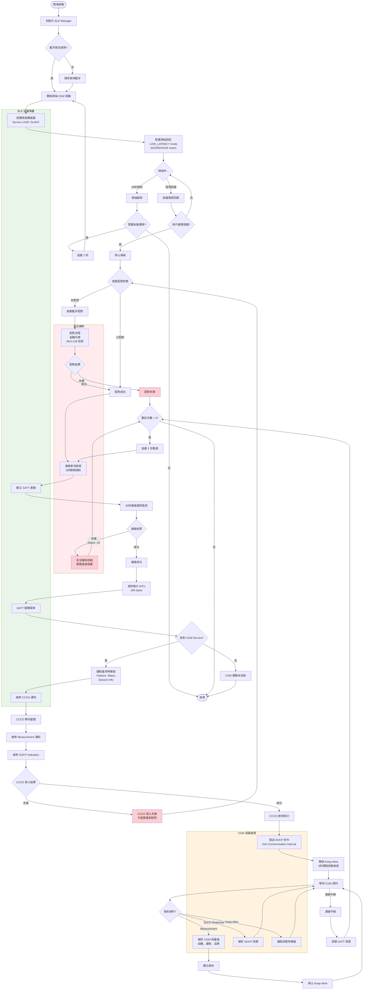

# BLE CGMS 工作流程圖

本檔案包含完整的 BLE CGMS 應用程式工作流程圖，展示從應用啟動到資料接收的完整過程。

## 完整工作流程



## 流程說明

### 1. 初始化階段
- **應用啟動**: 初始化 BLE Manager 和相關組件
- **藍牙檢查**: 確認藍牙功能是否啟用
- **權限驗證**: 確保具備必要的藍牙權限

### 2. 設備發現階段
- **掃描設置**: 使用 CGM Service UUID (0x181F) 進行篩選
- **掃描策略**: LOW_LATENCY 模式配合 AGGRESSIVE 匹配
- **超時處理**: 30 秒超時後自動重新掃描
- **用戶選擇**: 讓用戶從發現的設備中選擇目標

### 3. 安全連接階段
- **配對檢查**: 驗證設備是否已完成藍牙配對
- **金鑰交換**: 透過 Android BLE 堆疊處理 SMP 協議
- **加密建立**: 使用 AES-128 建立安全通道
- **節流機制**: 2 秒間隔限制防止頻繁連接

### 4. GATT 通信階段
- **服務探索**: 發現 CGM Service 和相關特徵值
- **MTU 協商**: 請求較大的 MTU (185 bytes) 提升效率
- **CCCD 啟用**: 分階段啟用通知和指示功能
- **隊列處理**: 避免 CCCD 操作衝突

### 5. CGM 協議階段
- **基本資訊**: 讀取 Feature, Status, Session Info
- **通知訂閱**: 啟用 Measurement 和 SOCP 通知
- **Keep-Alive**: 定期狀態檢查直到收到資料
- **資料解析**: 處理血糖測量值、趨勢和品質資訊

### 6. 錯誤處理機制
- **Status -19 錯誤**: CGM 安全機制拒絕，觸發重連邏輯
- **CCCD 失敗**: 可能需要重新配對或延遲重試
- **連接中斷**: 自動清理資源並嘗試重新連接
- **重試限制**: 最多 3 次重連嘗試避免無限循環

## 關鍵技術點

### 連接節流機制
```java
private static final long CONNECT_THROTTLE_MS = 2000;
```
防止頻繁連接觸發 CGM 設備的保護機制。

### CCCD 隊列處理
```java
private final Deque<UUID> cccdQueue = new ArrayDeque<>();
```
確保 CCCD 操作的順序性和可靠性。

### Keep-Alive 機制
```java
private static final long KEEPALIVE_INTERVAL_MS = 3000;
```
在收到第一筆測量資料前保持連接活躍。

### 超時保護
- 掃描超時: 30 秒
- 連接超時: 30 秒  
- CCCD 超時: 5 秒

這個流程圖完整展示了 BLE CGMS 應用程式從啟動到資料接收的所有關鍵步驟和錯誤處理邏輯。