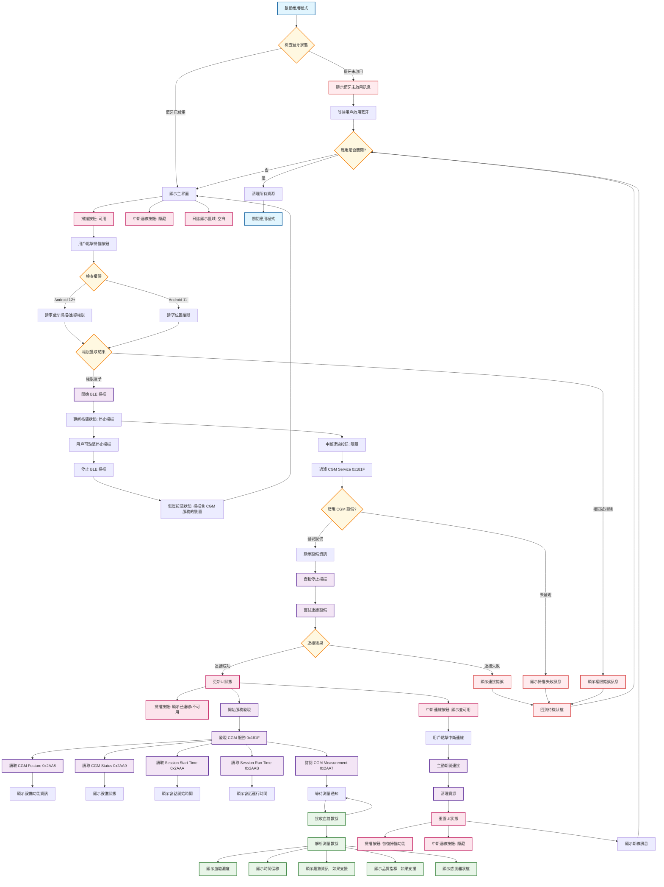

# BLE CGMS 應用程式功能流程圖

## 功能說明

### 🎯 主要功能模組

#### **1. 藍牙管理模組**
- 檢查藍牙狀態
- 權限管理 (依 Android 版本)
- 設備掃描與過濾

#### **2. 連接管理模組**
- 自動連接發現的設備
- 連接狀態追蹤
- 主動斷線功能

#### **3. GATT 服務模組**
- 服務發現
- 特性讀取
- 通知訂閱

#### **4. 數據處理模組**
- CGM 數據解析
- 實時數據顯示
- 狀態資訊解釋

#### **5. 用戶界面模組**
- 按鈕狀態管理
- 即時日誌顯示
- 用戶互動回饋

### 🔄 狀態轉換

| 狀態 | 掃描按鈕 | 中斷連線按鈕 | 說明 |
|------|----------|--------------|------|
| 初始狀態 | "掃描含 CGM 服務的裝置" (啟用) | 隱藏 | 應用啟動後的預設狀態 |
| 掃描中 | "停止掃描" (啟用) | 隱藏 | 正在掃描 BLE 設備，可隨時停止 |
| 已連線 | "已連線" (停用) | "中斷連線" (顯示並啟用) | 成功連接到 CGM 設備 |
| 斷線後 | "掃描含 CGM 服務的裝置" (啟用) | 隱藏 | 連線中斷後回到初始狀態 |

### 📊 數據流

**輸入數據流：**
CGM 設備 → BLE 通知 → 數據解析 → UI 顯示

**輸出數據流：**
用戶操作 → 按鈕事件 → BLE 命令 → 設備回應
